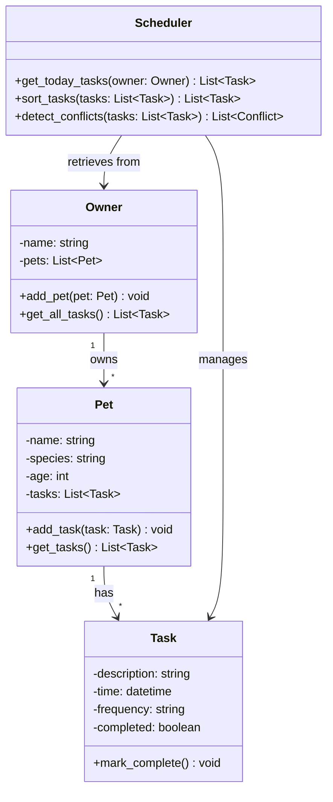

# PawPal+ Class Diagram

## Relationships
- **Owner → Pet**: One owner has many pets (1:*)
- **Pet → Task**: One pet has many tasks (1:*)
- **Scheduler → Owner**: Scheduler retrieves tasks from an owner
- **Scheduler → Task**: Scheduler manages task operations (sorting, conflict detection)

## Class Descriptions

**Owner**: Manages multiple pets and can retrieve all tasks across their pets
- `add_pet()`: Adds a new pet to the owner's collection
- `get_all_tasks()`: Returns all tasks from all pets

**Pet**: Represents a pet with associated tasks
- `add_task()`: Adds a new task for this pet
- `get_tasks()`: Returns all tasks for this pet

**Task**: Represents a single task for a pet
- `mark_complete()`: Marks the task as completed

**Scheduler**: Handles task organization and conflict detection
- `get_today_tasks()`: Retrieves tasks scheduled for today
- `sort_tasks()`: Sorts tasks by time
- `detect_conflicts()`: Identifies overlapping or conflicting tasks
